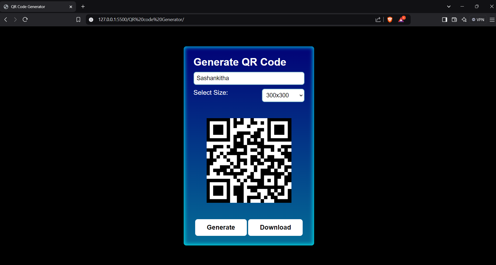

<h1>
  Drawing Web page
</h1>
<h3>
  Summary 
</h3>

  This drawing website is a web-based application designed for creative expression, using HTML, CSS, and JavaScript. The HTML provides the structural framework, including the canvas element for drawing and additional controls like buttons and sliders for tool selection. CSS is employed to style the layout, ensuring the website is visually appealing and user-friendly. JavaScript adds interactivity, enabling users to draw on the canvas with various tools.

Key features include brush selection, color palette, adjustable brush sizes, and an eraser tool. The “Clear Canvas” button resets the workspace, allowing users to start fresh. Advanced functionalities, like saving drawings as image files or undo-redo actions, can be integrated using JavaScript and external libraries.

This project demonstrates the seamless integration of frontend web development skills. It provides users with a responsive and interactive experience, showcasing how HTML, CSS, and JavaScript can be combined to create engaging, creative platforms. Ideal for beginners and developers alike, it highlights essential coding practices while offering opportunities for feature enhancement.

<h4>
  The output is like:-
</h4>
 
<h3>
  Proof
</h3>

